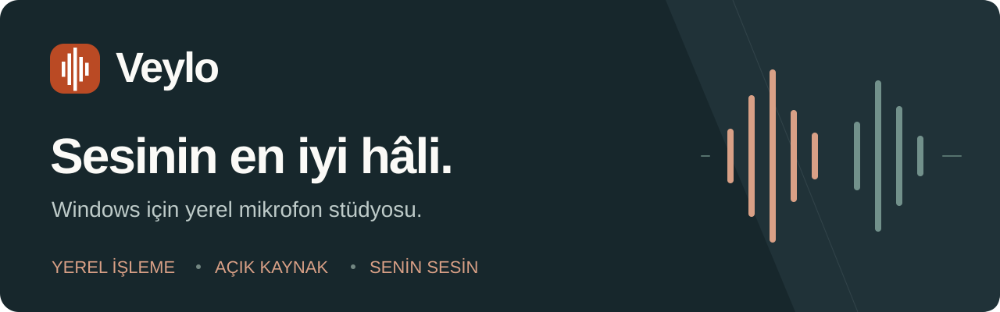
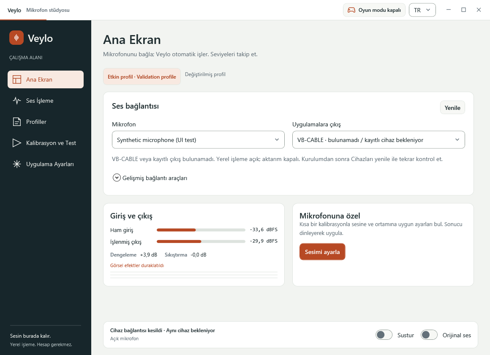
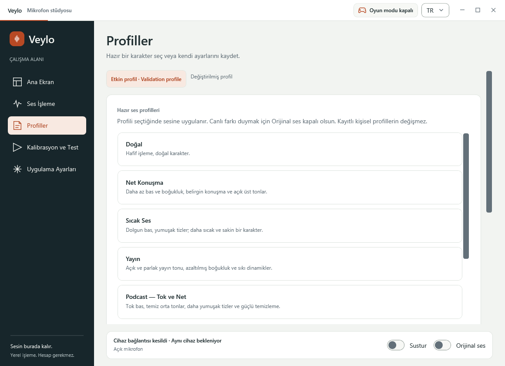
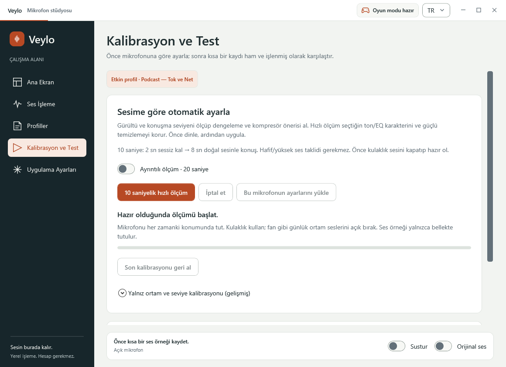

<p align="center">
  <picture>
    <source media="(max-width: 600px)" srcset="docs/assets/veylo-banner-small.svg">
    
  </picture>
</p>

<p align="center">
  <a href="https://github.com/alperensu/veylo/actions/workflows/windows.yml"></a>
  <a href="https://github.com/alperensu/veylo/releases"></a>
  <a href="LICENSE"></a>
  
</p>

<p align="center">
  <strong><a href="https://github.com/alperensu/veylo/releases/tag/v0.7.5-dev">Windows için indir</a></strong> ·
  <a href="docs/INSTALL.md">Kurulum rehberi</a> ·
  <a href="docs/FAQ.md">Sık sorulanlar</a> ·
  <a href="CONTRIBUTING.md">Katkıda bulun</a> ·
  <a href="docs/README.en.md">English</a>
</p>

# Mikrofonun için küçük bir stüdyo

**Veylo**, mikrofon sesini bilgisayarında işleyen açık kaynak bir Windows uygulaması.
Arka plan gürültüsünü azalt, konuşma seviyeni dengele ve sesinin karakterini kendine göre ayarla.
Kayıt, yayın, toplantı, sesli iletişim ve oyun için tek bir çalışma alanı.

**Hesap yok. Abonelik yok. Sesini buluta göndermek yok.** Günlük ses işleme internet veya GPU gerektirmez.

> **Geliştirme sürümü · 0.7.5-dev**
> Uygulamalara ses aktarımı şu anda **VB-CABLE** üzerinden yapılır; ayrıca kurulmalıdır.
> Kendi Veylo Mikrofon sürücümüz yalnız izole laboratuvarda test edilmiştir ve normal Setup'a dahil değildir.
> Tüm cihazlarda ses kalitesi, uyumluluk veya performans garantisi verilmez. [Doğrulanan kapsam →](docs/ACCEPTANCE.md)



<sub>Gerçek uygulama arayüzünün kontrollü test modundaki görüntüsü. Gösterilen cihaz, profil ve seviye değerleri örnektir; canlı mikrofon ölçümü değildir.</sub>

## Temizle. Dengele. Kendine göre ayarla.

| | Ne yapabilirsin? |
| --- | --- |
| **Arka planı temizle** | RNNoise gürültü azaltma, manuel veya otomatik temizleme gücü, güçlü temizleme ve ayarlanabilir giriş duyarlılığı. |
| **Konuşmanı dengele** | Konuşma sırasında otomatik seviye dengeleme; kompresör, kazanç sınırları ve güvenlik limiter'i. |
| **Tonunu şekillendir** | Dört bant EQ, sıcaklık ve netlik kontrolleri, alt frekans kesimi ve keskin “s/ş” sesleri için de-esser. |
| **Sesine uyarla** | 10 saniyelik hızlı veya 20 saniyelik ayrıntılı kalibrasyon; öneriyi dinle, uygula veya geri al. |
| **Farkı dinle** | En fazla 20 saniyelik aynı örneği ham ve işlenmiş olarak, ses yüksekliği eşlenmiş karşılaştır. |
| **Kendi profilini oluştur** | Hazır profilleri kullan; kişisel ayarlarını kaydet, sürümlü JSON olarak içe veya dışa aktar. |
| **Arka planda kullan** | Açılışta otomatik işleme, bildirim alanı, susturma ve orijinal ses kısayolları, isteğe bağlı basılı tutarak konuşma. |
| **Oyuna odaklan** | Otomatik oyun modu algılandığında görsel efektleri durdurur; ses işleme devam eder. FPS artışı vaadi değildir. |

## İlk sesini üç adımda gönder

1. **İndir ve kur.** [0.7.5-dev sürümünden](https://github.com/alperensu/veylo/releases/tag/v0.7.5-dev)
   `Veylo-0.7.5-dev-win-x64-Setup.exe` dosyasını indir.
   Kurulum istemiyorsan taşınabilir ZIP'i tamamen çıkarıp `Veylo.exe` dosyasını aç.
   [.NET'i ayrıca kurman gerekmez.](docs/INSTALL.md)
2. **Mikrofonunu bağla.** [VB-CABLE'ı resmî kaynaktan](https://vb-audio.com/Cable/) kur;
   gerekirse Windows'u yeniden başlat. Veylo'da fiziksel mikrofonunu ve **VB-CABLE / CABLE Input** çıkışını seç.
   Veylo açıldığında işleme otomatik başlar.
3. **Kullandığın uygulamaya aktar.** Kayıt, toplantı, yayın veya iletişim uygulamanda mikrofon girişi olarak
   **CABLE Output** seç. Kulaklık/hoparlör çıkışın kendi normal ses aygıtın olarak kalsın.

```text
Fiziksel mikrofon → Veylo → CABLE Input → CABLE Output → Kullandığın uygulama
```

**Input ve Output neden ters görünüyor?** Veylo kabloya ses *verir*; diğer uygulama kablodan ses *alır*.
VB-CABLE yokken yerel işleme ve kalibrasyon kullanılabilir, ancak diğer uygulamalara ses aktarılmaz.

| İndirme | Kullanım |
| --- | --- |
| [**Windows Setup**](https://github.com/alperensu/veylo/releases/download/v0.7.5-dev/Veylo-0.7.5-dev-win-x64-Setup.exe) | Kullanıcı hesabına kurulum ve Başlat menüsü kısayolu. |
| [**Taşınabilir ZIP**](https://github.com/alperensu/veylo/releases/download/v0.7.5-dev/Veylo-0.7.5-dev-win-x64.zip) | Tamamını çıkar, `Veylo.exe` dosyasını çalıştır. |
| [**Kaynak kod**](https://github.com/alperensu/veylo/releases/download/v0.7.5-dev/Veylo-0.7.5-dev-source.zip) | İncele, kendin derle veya katkıda bulun. |

Her paketin SHA-256 dosyası [sürüm sayfasında](https://github.com/alperensu/veylo/releases/tag/v0.7.5-dev) bulunur.
Geliştirme Setup'ı kod imzalı değildir; Windows yayıncı uyarısı gösterebilir.
Güvenlik ayarlarını kapatma; kaynağı ve checksum'ı [kurulum rehberiyle](docs/INSTALL.md) doğrula.

## Bir ses karakteri seç

| Profil | Başlangıç karakteri |
| --- | --- |
| **Doğal** | Hafif işleme, doğal ton. |
| **Net Konuşma** | Daha az boğukluk, belirgin konuşma ve açık üst tonlar. |
| **Sıcak Ses** | Dolgun bas ve daha yumuşak tizler. |
| **Yayın** | Açık, parlak ton ve daha sıkı dinamikler. |
| **Podcast — Tok ve Net** | Tok bas, temiz orta tonlar, daha yumuşak tizler ve güçlü temizleme. |

Profil seçtikten sonra **Kalibrasyon ve Test** bölümünde sesine göre ayarla.
Hızlı ölçümde 2 saniye sessiz kal, ardından 8 saniye doğal sesinle konuş.
Seçtiğin ton korunur; öneriyi dinleyip uygulamak sana kalır. Mikrofon, ortam ve konuşma biçimi sonucu etkiler.

<details>
<summary><strong>Arayüzü keşfet: profiller ve kalibrasyon</strong></summary>

### Hazır profiller ve kişisel ayarlar



### Mikrofonuna ve sesine göre kalibrasyon



Görüntüler kontrollü arayüz testlerinden alınmıştır; cihaz ve ölçüm değerleri örnektir.

</details>

## Sesin senin bilgisayarında kalır

Ses işleme yereldir. Karşılaştırma örneği bellekte tutulur; ses dosyası yalnızca sen WAV dışa aktarımını seçersen yazılır.
Paylaşılan JSON profilleri ses kaydı veya cihaz kimliği içermez. Normal uygulama yönetici izni istemez;
VB-CABLE'ın ayrı sürücü kurulumu isteyebilir.

Veylo bütün dış sesleri silemez, yakındaki konuşmacıları kesin olarak ayıramaz veya bozuk mikrofon donanımını onaramaz.
Kısık kelimeleri ve cümle başlangıçlarını kendi mikrofonunla dinleyerek kontrol et.
[Gizlilik ve güvenlik sınırları](SECURITY.md) · [Sık sorulanlar](docs/FAQ.md)

## Açık geliştirme, açık doğrulama

Veylo **Windows 10/11 x64** için geliştirilir. C++20 ses motoru, miniaudio/WASAPI, RNNoise ve C#/.NET 10 WPF kullanır.
Hedeflenen sistemler ile gerçekten doğrulanan cihaz ve koşullar [kabul tablosunda](docs/ACCEPTANCE.md) ayrıdır.

Kendi sanal mikrofonumuz Windows 11 VM'de kısa kernel ve PCM16/PCM32 ses testlerini, standart Driver Verifier açıkken de geçti.
**Microsoft üretim imzası, HVCI, uzun süreli testler ve gerçek alıcı uygulama kabulü bekleniyor.**
Laboratuvar paketini günlük bilgisayara kurma; günlük aktarım için VB-CABLE kullan.
CPU, bellek ve gecikme hedefleri tamamlanmış performans garantileri değildir.

| Belge | İçeriği |
| --- | --- |
| [Kurulum ve kullanım](docs/INSTALL.md) | Cihaz bağlantısı, kalibrasyon, kısayollar ve sorun giderme. |
| [Sık sorulanlar](docs/FAQ.md) | Ses gelmiyor, gürültü geçiyor, ekran paylaşımı ve sürücü soruları. |
| [Kabul durumu](docs/ACCEPTANCE.md) | Özellik bazında Passed / Partial / Not run. |
| [Doğrulama raporu](docs/VALIDATION.md) | Çalıştırılan testler, ölçümler ve sınırlar. |
| [Geliştirici rehberi](docs/DEVELOPMENT.md) | Derleme, test, paketleme ve laboratuvar araçları. |
| [Sürüm notları](docs/CHANGELOG.md) | Geliştirme geçmişi ve geçmiş ölçümler. |
| [Sanal mikrofon laboratuvarı](docs/DRIVER-LAB.md) | İzole test kurulumu ve günlük kullanıma geçiş koşulları. |

## Birlikte geliştirelim

Yeni bir mikrofonla denemek, anlaşılır bir hata bildirimi yazmak, çeviriyi geliştirmek veya kodla katkıda bulunmak değerlidir.
[Hata bildir / fikir öner](https://github.com/alperensu/veylo/issues/new/choose) ·
[Katkı rehberi](CONTRIBUTING.md) ·
[Güvenlik açığını özel bildir](https://github.com/alperensu/veylo/security/advisories/new)

Ses kayıtlarını, kişisel konuşmaları ve cihaz kimliklerini herkese açık Issue'lara ekleme.

Veylo kaynak kodu [MIT](LICENSE) lisanslıdır. Bağımlılık bildirimleri [THIRD_PARTY_NOTICES.md](THIRD_PARTY_NOTICES.md) içindedir.
VB-CABLE ayrı bir üründür; pakete dahil edilmez ve kendi lisans koşullarına tabidir.
