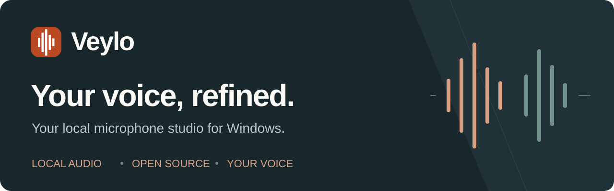

<p align="center">
  <picture>
    <source media="(max-width: 600px)" srcset="assets/veylo-banner-small.en.svg">
    
  </picture>
</p>

<p align="center">
  <a href="https://github.com/alperensu/veylo/actions/workflows/windows.yml"></a>
  <a href="https://github.com/alperensu/veylo/releases"></a>
  <a href="../LICENSE"></a>
  
</p>

<p align="center">
  <strong><a href="https://github.com/alperensu/veylo/releases/tag/v0.7.5-dev">Download for Windows</a></strong> ·
  <a href="INSTALL.md">Setup guide (TR)</a> ·
  <a href="../CONTRIBUTING.md">Contribute</a> ·
  <a href="../README.md">Türkçe</a>
</p>

# A small studio for your microphone

**Veylo** is an open-source Windows application that processes microphone audio locally.
Reduce background noise, level your speech and shape your voice for recordings,
streams, meetings, voice chat and games. The app has Turkish and English UI.

**No account. No subscription. No cloud audio processing.** Everyday audio processing does not require internet access or a GPU.

> **Development release · 0.7.5-dev**
> Routing to other applications currently requires **VB-CABLE**, installed separately.
> Our own Veylo Microphone driver has only been tested in an isolated lab; it is not included in the normal installer.
> Audio quality, performance and compatibility have not been verified on every device. [Acceptance status (TR) →](ACCEPTANCE.md)


<sub>Actual application UI captured in controlled test mode. Device, profile and level values are examples, not live microphone measurements.</sub>

## Clean, level and shape your voice

| Feature | What it does |
| --- | --- |
| **Noise reduction** | RNNoise, manual or automatic strength, strong cleaning and adjustable input sensitivity. |
| **Voice leveling** | Speech-aware level balancing, compressor, gain limits and a safety limiter. |
| **Tone controls** | Four-band EQ, warmth and clarity, high-pass filter and de-esser. |
| **Personal calibration** | A 10-second quick or 20-second detailed measurement; listen, apply or undo. |
| **Before/after** | Compare the same sample, up to 20 seconds, with loudness matched. |
| **Profiles** | Five built-in presets, personal settings and versioned JSON import/export. |
| **Background operation** | Automatic processing on startup, tray controls, mute/bypass shortcuts and optional push-to-talk. |
| **Game mode** | Pauses visual effects when a game is detected while audio processing continues. No FPS improvement is promised. |

## Get connected in three steps

1. Download `Veylo-0.7.5-dev-win-x64-Setup.exe` from the
   [release page](https://github.com/alperensu/veylo/releases/tag/v0.7.5-dev).
   Or extract the entire portable ZIP and open `Veylo.exe`. A separate .NET installation is not required.
2. Install [VB-CABLE from its official website](https://vb-audio.com/Cable/), restarting Windows if needed.
   Select your **physical microphone** as Veylo's input and **VB-CABLE / CABLE Input** as its output.
   Processing starts automatically when Veylo opens.
3. Select **CABLE Output** as the microphone input in your recording, meeting, streaming or communication app.
   Keep that app's playback output on your usual headphones or speakers.

```text
Physical microphone → Veylo → CABLE Input → CABLE Output → Your application
```

Veylo sends audio **into** the cable; the other application receives audio **out of** it.
Without VB-CABLE, local processing and calibration still work, but processed audio is not routed to other apps.

| Download | Use |
| --- | --- |
| [**Windows installer**](https://github.com/alperensu/veylo/releases/download/v0.7.5-dev/Veylo-0.7.5-dev-win-x64-Setup.exe) | Per-user installation and Start menu shortcut. |
| [**Portable ZIP**](https://github.com/alperensu/veylo/releases/download/v0.7.5-dev/Veylo-0.7.5-dev-win-x64.zip) | Extract the complete package and run `Veylo.exe`. |
| [**Source ZIP**](https://github.com/alperensu/veylo/releases/download/v0.7.5-dev/Veylo-0.7.5-dev-source.zip) | Inspect, build or contribute. |

SHA-256 files are on the release page. The development installer is not code-signed;
Windows may display an unknown-publisher warning. Keep Windows security protections enabled,
check the official source and compare the downloaded file against its published checksum.

## Pick a voice character

| Preset | Starting character |
| --- | --- |
| **Natural / Doğal** | Light processing and a natural tone. |
| **Clear Speech / Net Konuşma** | Less muddiness, clearer speech and open upper frequencies. |
| **Warm Voice / Sıcak Ses** | Fuller bass and softer highs. |
| **Broadcast / Yayın** | Brighter tone and tighter dynamics. |
| **Podcast / Tok ve Net** | Full bass, clear mids, softer highs and strong cleaning. |

Use Calibration and Test after choosing a preset. Stay quiet for 2 seconds, then
speak naturally for 8 seconds in the quick measurement. Your selected EQ character
is preserved; listen to the recommendation before applying it. Results depend on
your microphone, environment and voice.

<details>
<summary><strong>Explore profiles and calibration</strong></summary>


Screenshots are from controlled UI tests; device and measurement values are examples.

</details>

## Local processing and honest limits

Comparison samples stay in memory unless you explicitly export a WAV file.
Shared JSON profiles contain no audio recordings or device identifiers.
The normal app runs without administrator privileges; a separate driver installer may request elevation.

Veylo cannot remove every external sound, reliably separate nearby speakers or
repair microphone hardware. Check quiet words and sentence beginnings with your own microphone.
Close the window to keep processing in the tray; choose **Exit Veylo** to stop it.

The target is **Windows 10/11 x64**. The stack is C++20, miniaudio/WASAPI, RNNoise
and C#/.NET 10 WPF. CPU, memory and latency targets are not verified performance guarantees.

Our virtual microphone passed short kernel and PCM16/PCM32 capture tests in a Windows 11 VM,
including standard Driver Verifier. **Microsoft production signing, HVCI, endurance
and real receiving-application acceptance remain pending.** Do not install the
test-signed lab package on your daily computer; use VB-CABLE for everyday routing.

## Documentation and community

The detailed guides are currently in Turkish:
[Setup](INSTALL.md) · [FAQ](FAQ.md) · [Acceptance](ACCEPTANCE.md) ·
[Validation](VALIDATION.md) · [Development](DEVELOPMENT.md) · [Changelog](CHANGELOG.md).

[Report a bug, suggest a feature or ask a question](https://github.com/alperensu/veylo/issues/new/choose).
English reports are welcome. Please keep personal recordings, conversations and
device identifiers out of public Issues. For sensitive findings, use
[private vulnerability reporting](https://github.com/alperensu/veylo/security/advisories/new).
See the [security policy](../SECURITY.md) and [contribution guide](../CONTRIBUTING.md).

Veylo's source is [MIT licensed](../LICENSE). Dependency notices are in
[THIRD_PARTY_NOTICES.md](../THIRD_PARTY_NOTICES.md). VB-CABLE is a separate product,
is not bundled, and has its own license terms.
